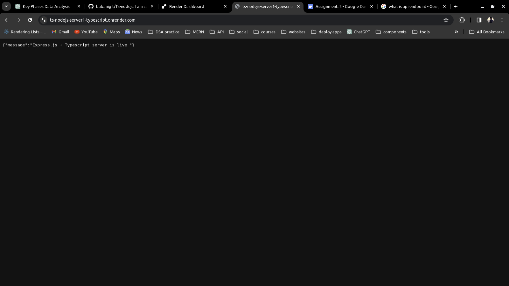

# Ts-nodejs

backend API :- https://ts-mern-project-server.onrender.com (deployed on Render.com)

Note : - The backend Express API has been successfully completed and seamlessly connected to the frontend React application, all developed using TypeScript. With this integration in place, the foundation for a robust and efficient web application has been laid.

Now, the focus shifts to crafting the frontend user interface, where the user experience truly comes to life. By leveraging the power of React and TypeScript, we aim to create an intuitive and visually appealing interface that enhances user interaction and engagement.

<!--  -->

